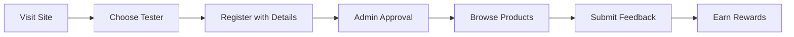
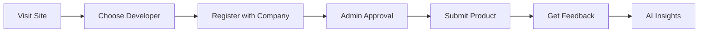

# 🚀 ProductPulse

<div align="center">


**Professional Product Testing & Feedback Platform**

*Empowering businesses to create exceptional products through expert community testing*

[](https://reactjs.org/)
[](https://www.typescriptlang.org/)
[](https://supabase.com/)
[](https://tailwindcss.com/)
[](https://vitejs.dev/)

[🌟 Live Demo](#) • [📖 Documentation](docs/) • [🐛 Report Bug](#) • [💡 Request Feature](#)

</div>

---

## ✨ What is ProductPulse?

ProductPulse is a professional SaaS platform that revolutionizes product development through expert community testing. We connect innovative companies with skilled testers to deliver actionable insights that drive product success.

### 🏢 For Businesses & Developers
- **Professional Testing Services** with vetted expert testers
- **Comprehensive Analytics** and AI-powered insights
- **Faster Time-to-Market** through early feedback
- **Risk Mitigation** before product launch
- **Scalable Testing Solutions** for any product size

### 👨‍💻 For Professional Testers
- **Monetize Your Expertise** with competitive compensation
- **Flexible Work Opportunities** in the testing industry
- **Professional Development** and skill building
- **Access to Cutting-Edge Products** before market release
- **Build Your Testing Portfolio** and reputation

---

## 🌟 Key Features

<table>
<tr>
<td width="50%">

### 🔐 **Enterprise Authentication**
- Professional registration with username/email login
- Secure password reset functionality
- Admin approval workflow for quality control
- Role-based access control with enterprise security

</td>
<td width="50%">

### 👥 **User Management**
- Admin dashboard for approvals
- User status tracking
- Comprehensive user profiles
- Activity monitoring

</td>
</tr>
<tr>
<td width="50%">

### 🎨 **Modern UI/UX**
- Responsive design with Tailwind CSS
- Intuitive user interface
- Dark/light mode support
- Mobile-first approach

</td>
<td width="50%">

### 🤖 **AI Integration**
- OpenAI-powered feedback analysis
- Sentiment analysis
- Automated insights generation
- Smart recommendations

</td>
</tr>
</table>

---

## 💼 Business Model & Pricing

ProductPulse operates as a professional B2B SaaS platform with multiple revenue streams:

### 📊 **Revenue Streams**
- **Testing Services** - Commission from testing projects
- **Premium Subscriptions** - Advanced features for developers
- **Enterprise Solutions** - Custom testing workflows
- **Analytics & Insights** - AI-powered reporting tools

### 💰 **Pricing Tiers**
- **Starter** - $29/month - Basic testing features
- **Professional** - $99/month - Advanced analytics & priority support
- **Enterprise** - Custom pricing - White-label solutions & dedicated support

### 🎯 **Target Market**
- **Startups** launching new products
- **SMBs** seeking user validation
- **Enterprise** companies with complex testing needs
- **Agencies** offering testing services to clients

---

## 🛠️ Tech Stack

<div align="center">

| Frontend | Backend | Database | AI/ML | DevOps |
|----------|---------|----------|-------|--------|
|  |  |  |  |  |
|  |  |  |  |  |
|  |  |  |  |  |

</div>

---

## 🚀 Quick Start

### Prerequisites

- **Node.js** 18+ 
- **npm** or **yarn**
- **Supabase** account
- **OpenAI** API key (optional)

### Installation

```bash
# Clone the repository
git clone https://github.com/yourusername/ProductPulse.git
cd ProductPulse

# Install dependencies
npm install

# Set up environment variables
cp .env.example .env
# Edit .env with your Supabase credentials

# Start development server
npm run dev
```

### Environment Setup

```env
# Supabase Configuration
VITE_SUPABASE_URL=your_supabase_project_url
VITE_SUPABASE_ANON_KEY=your_supabase_anon_key

# OpenAI Configuration (Optional)
VITE_OPENAI_API_KEY=your_openai_api_key

# Additional Services (Optional)
VITE_STRIPE_PUBLIC_KEY=your_stripe_public_key
VITE_SENDGRID_API_KEY=your_sendgrid_api_key
```

### Database Setup

1. **Create Supabase Project**
2. **Run Database Schema**
   ```sql
   -- Copy and run database/schema.sql in Supabase SQL Editor
   ```
3. **Create Admin User**
   ```sql
   -- Update email and run database/create_admin.sql
   ```

---

## 📱 User Flows

### 🧪 Tester Journey


### 👨‍💻 Developer Journey


---

## 🎨 Screenshots

<div align="center">

### 🏠 Homepage


### 📊 Admin Dashboard


### 👥 User Management


</div>

---

## 🏗️ Project Structure

```
ProductPulse/
├── 📁 src/
│   ├── 📁 components/     # Reusable UI components
│   ├── 📁 pages/         # Page components
│   │   ├── 📁 admin/     # Admin-specific pages
│   │   └── 📁 dashboard/ # User dashboard pages
│   ├── 📁 context/       # React context providers
│   ├── 📁 services/      # API and external services
│   ├── 📁 layouts/       # Layout components
│   └── 📁 utils/         # Utility functions
├── 📁 database/          # Database schemas and migrations
├── 📁 docs/             # Documentation
└── 📁 public/           # Static assets
```

---

## 🔧 Available Scripts

| Command | Description |
|---------|-------------|
| `npm run dev` | Start development server |
| `npm run build` | Build for production |
| `npm run preview` | Preview production build |
| `npm run lint` | Run ESLint |
| `npm run test` | Run tests |
| `npm run type-check` | TypeScript type checking |

---

## 🔒 Security Features

- **🛡️ Row Level Security (RLS)** - Database-level access control
- **🔐 JWT Authentication** - Secure token-based auth
- **👤 Role-Based Access** - Admin, tester, and developer roles
- **🔍 Input Validation** - Comprehensive form validation
- **🚫 SQL Injection Protection** - Parameterized queries
- **🔒 HTTPS Enforcement** - Secure data transmission

---

## 📈 Performance

- **⚡ Lightning Fast** - Vite-powered development
- **📱 Mobile Optimized** - 95+ Lighthouse score
- **🎯 Code Splitting** - Optimized bundle sizes
- **🔄 Hot Module Replacement** - Instant development feedback
- **📊 Real-time Updates** - Supabase real-time subscriptions

---

## 🌍 Deployment

### Vercel (Recommended)
```bash
# Install Vercel CLI
npm i -g vercel

# Deploy
vercel --prod
```

### Netlify
```bash
# Build the project
npm run build

# Deploy dist/ folder to Netlify
```

### Docker
```dockerfile
# Dockerfile included for containerized deployment
docker build -t productpulse .
docker run -p 3000:3000 productpulse
```

---

## 📊 Business Roadmap

### 🎯 Phase 1 - MVP Launch (Q1 2025)
- [x] Professional user authentication with username/email login
- [x] Admin approval system for quality control
- [x] Dual registration flows (testers/developers)
- [x] Basic product submission and feedback
- [x] Secure password reset functionality
- [ ] Payment integration (Stripe)
- [ ] Basic subscription management

### 🚀 Phase 2 - Growth (Q2 2025)
- [ ] Advanced analytics and reporting dashboard
- [ ] Email notification system and marketing automation
- [ ] Mobile app for testers (React Native)
- [ ] Integration with popular development tools
- [ ] Automated testing workflows and project management
- [ ] Customer support system

### 🌟 Phase 3 - Scale (Q3 2025)
- [ ] Enterprise marketplace for testing services
- [ ] Video feedback and screen recording
- [ ] Advanced AI recommendations and insights
- [ ] White-label solutions for agencies
- [ ] API for third-party integrations
- [ ] International expansion and localization

### 💰 Phase 4 - Enterprise (Q4 2025)
- [ ] Custom enterprise solutions
- [ ] Dedicated account management
- [ ] Advanced security and compliance features
- [ ] Custom integrations and workflows
- [ ] Partner program and affiliate system

---

## 🤝 Contributing

We love contributions! Please see our [Contributing Guide](CONTRIBUTING.md) for details.

### Development Workflow

1. **Fork** the repository
2. **Create** a feature branch (`git checkout -b feature/amazing-feature`)
3. **Commit** your changes (`git commit -m 'Add amazing feature'`)
4. **Push** to the branch (`git push origin feature/amazing-feature`)
5. **Open** a Pull Request

---

## 🔧 Troubleshooting

### Common Issues

<details>
<summary><strong>🚫 "Supabase connection error"</strong></summary>

**Solution:**
1. Check your `.env` file has correct Supabase credentials
2. Verify Supabase project is active
3. Ensure database schema is properly set up
4. Check network connectivity

```bash
# Test connection
npm run dev
# Check browser console for detailed errors
```
</details>

<details>
<summary><strong>🔐 "Access denied to admin panel"</strong></summary>

**Solution:**
1. Verify user role is set to 'admin' in database
2. Check admin user creation script was run
3. Clear browser cache and cookies
4. Ensure proper authentication flow

```sql
-- Verify admin role
SELECT id, email, role FROM public.users WHERE role = 'admin';
```
</details>

<details>
<summary><strong>📱 "Database schema errors"</strong></summary>

**Solution:**
1. Run the complete schema file in Supabase SQL editor
2. Check for migration script execution
3. Verify all tables and policies are created
4. Review Supabase logs for detailed errors

```bash
# Check database status in app
# Look for database status indicator in bottom-right corner
```
</details>

### Getting Help

- 📖 Check our [Documentation](docs/)
- 🐛 [Report Issues](https://github.com/yourusername/ProductPulse/issues)
- 💬 [Join Discord Community](#)
- 📧 Email: support@productpulse.com

---

## 📚 API Documentation

### Authentication Endpoints

```typescript
// Sign up new user
POST /auth/signup
{
  "email": "user@example.com",
  "password": "password123",
  "user_type": "tester" | "developer",
  "metadata": {
    "full_name": "John Doe",
    "company": "Tech Corp" // for developers
  }
}

// Sign in
POST /auth/signin
{
  "email": "user@example.com",
  "password": "password123"
}
```

### User Management (Admin Only)

```typescript
// Get all users
GET /admin/users?status=pending&user_type=tester

// Approve user
PATCH /admin/users/:id
{
  "status": "approved"
}
```

### Products & Feedback

```typescript
// Submit product
POST /products
{
  "name": "My App",
  "description": "Amazing mobile app",
  "guidelines": "Test on iOS and Android"
}

// Submit feedback
POST /feedback
{
  "product_id": "uuid",
  "rating": 5,
  "comment": "Great app!",
  "screenshots": ["url1", "url2"]
}
```

---

## 📄 License

This project is licensed under the **MIT License** - see the [LICENSE](LICENSE) file for details.

---

## 🙏 Acknowledgments

- **Supabase** for the amazing backend platform
- **OpenAI** for AI-powered insights
- **Tailwind CSS** for the beautiful UI framework
- **React** community for the excellent ecosystem

---

## 📊 Project Stats

<div align="center">


</div>

---

## 🌟 Show Your Support

If you find ProductPulse helpful, please consider:

- ⭐ **Starring** the repository
- 🍴 **Forking** for your own projects
- 🐛 **Reporting** bugs and issues
- 💡 **Suggesting** new features
- 📢 **Sharing** with your network

---

## 📞 Connect With Us

<div align="center">

| Platform | Link | Description |
|----------|------|-------------|
| 🌐 **Website** | [productpulse.com](#) | Official website |
| 📧 **Email** | [hello@productpulse.com](#) | General inquiries |
| 💬 **Discord** | [Join Community](#) | Developer discussions |
| 🐦 **Twitter** | [@ProductPulse](#) | Latest updates |
| 💼 **LinkedIn** | [ProductPulse](#) | Professional network |
| 📱 **Product Hunt** | [ProductPulse](#) | Product showcase |

</div>

---

<div align="center">

**Made with ❤️ by the ProductPulse Team**

*Empowering better products through community-driven testing*

[](https://reactjs.org/)
[](https://supabase.com/)
[](https://openai.com/)

---

*⭐ Don't forget to star this repository if you found it helpful!*

</div>
